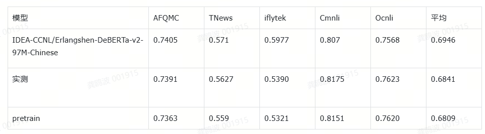

# bert_pretraind

本项目是从头开始预训练bert并进行下游任务的微调测试，使用到的框架为Fengshen-LM。

训练的模型为erlangshen-deberta-base-97M。

# 数据准备

使用的数据为wudao-200G，数据可以从[Data Hub](https://data.baai.ac.cn/details/WuDaoCorporaText) 下载。

下载好数据之后需要对文本进行分句处理。

可以运行data/process.py，将处理好的数据存储在某个位置。

分完句之后，需要处理成dataset的格式并存储，方便后续读取，可使用Fengshenbang-LM/fengshen\data/fs_datasets/wudao/load.py里面的函数。

# 环境构建

如果是4090环境，可直接使用Fengshenbang-LM里面提及的docker环境，如果是A800，建议重新搭建环境。

使用镜像：[docker.io/pytorch/pytorch 项目中国可用镜像列表 | 高速可靠的 Docker 镜像资源](https://docker.aityp.com/r/docker.io/pytorch/pytorch)

根据自己的cuda版本找到对应的镜像，需要注意的是要使用`-devel`后缀的才带有cuda tookit。

额外注意：`torch==2.3.0、pytorch_lightning==1.8.4`

在Fengshenbang-LM下`pip install -e .`

最后可以运行进入到Fengshenbang-LM/fengshen/examples/pretrain_erlangshen_deberta_v2/，运行`sh pretrain_deberta_base_wudao.sh`启动训练。

```shell
#!/bin/bash
#SBATCH --job-name=pretrain_bart # create a short name for your job
#SBATCH --nodes=1 # node count
#SBATCH --ntasks-per-node=8 # number of tasks to run per node
#SBATCH --cpus-per-task=30 # cpu-cores per task (>1 if multi-threaded tasks)
#SBATCH --gres=gpu:8 # number of gpus per node
#SBATCH -o %x-%j.log # output and error log file names (%x for job id)
#SBATCH -x dgx050

# pwd=Fengshenbang-LM/fengshen/examples/pretrain_erlangshen
ROOT_DIR=../../workspace
export TORCH_EXTENSIONS_DIR=${ROOT_DIR}/torch_extendsions

MODEL_NAME=erlangshen-deberta-base
MODEL_ROOT_DIR=$ROOT_DIR/${MODEL_NAME}
if [ ! -d ${MODEL_ROOT_DIR} ];then
  mkdir ${MODEL_ROOT_DIR}
fi

NNODES=1
GPUS_PER_NODE=8

MICRO_BATCH_SIZE=32

# 如果你不用Deepspeed的话 下面的一段话都可以删掉 Begin
CONFIG_JSON="$MODEL_ROOT_DIR/${MODEL_NAME}.ds_config.json"
ZERO_STAGE=1
# Deepspeed figures out GAS dynamically from dynamic GBS via set_train_batch_size()
cat <<EOT > $CONFIG_JSON
{
    "zero_optimization": {
        "stage": ${ZERO_STAGE}
    },
    "fp16": {
        "enabled": true
    },
    "gradient_clipping": 1,
    "train_micro_batch_size_per_gpu": $MICRO_BATCH_SIZE
}
EOT
export PL_DEEPSPEED_CONFIG_PATH=$CONFIG_JSON
### End

DATA_ARGS="\
        --dataloader_workers 2 \
        --train_batchsize $MICRO_BATCH_SIZE  \
        --val_batchsize $MICRO_BATCH_SIZE \
        --test_batchsize $MICRO_BATCH_SIZE  \
	    --datasets_name wudao \
        --raw_file_type json \
        --val_datasets_field train \
        --test_datasets_field train \
        --check_val_every_n_epoch 1000000 \
        "
# -raw_file_type json \
#--train_file /data/gongoubo/Fengshenbang-LM/fengshen/examples/pretrain_erlangshen_deberta_v2/PretrainCorpusDemo/data/train.json \
#--val_file /data/gongoubo/Fengshenbang-LM/fengshen/examples/pretrain_erlangshen_deberta_v2/PretrainCorpusDemo/data/train.json \
#--test_file /data/gongoubo/Fengshenbang-LM/fengshen/examples/pretrain_erlangshen_deberta_v2/PretrainCorpusDemo/data/train.json \

# 如果你有一批数据，可以参照IDEA-CCNL/PretrainCorpusDemo的格式处理，通过参数传入
# --train_file train.json
# --val_file val.json
# --test_file test.json

MODEL_ARGS="\
        --model_path $MODEL_ROOT_DIR/pretrain \
        --learning_rate 1e-4 \
        --weight_decay 1e-1 \
        --warmup_ratio 0.01 \
        "

MODEL_CHECKPOINT_ARGS="\
        --save_last \
        --save_ckpt_path ${MODEL_ROOT_DIR}/ckpt \
        --load_ckpt_path ${MODEL_ROOT_DIR}/ckpt/last.ckpt \
        "

TRAINER_ARGS="\
        --max_epoch 10 \
        --gpus $GPUS_PER_NODE \
        --num_nodes $NNODES \
        --strategy deepspeed_stage_${ZERO_STAGE} \
        --log_every_n_steps 1 \
        --precision 16 \
        --default_root_dir ${MODEL_ROOT_DIR} \
        --replace_sampler_ddp False \
        --save_on_train_epoch_end \
        "

export options=" \
        $DATA_ARGS \
        $MODEL_ARGS \
        $MODEL_CHECKPOINT_ARGS \
        $TRAINER_ARGS \
        "

python3 pretrain_deberta.py $options
#srun -N $NNODES --gres=gpu:$GPUS_PER_NODE --ntasks-per-node=$GPUS_PER_NODE --cpus-per-task=20 python3 pretrain_deberta.py $options

```

# 转换模型为huggingface

训练完之后会在Fengshenbang-LM/fengshen/workspace/erlangshen-deberta-base下生成保存的权重，另外会有一个zero_to_fp32.py将模型权重转换为fp32的权重，然后再根据情况将转换后的模型映射到huggingface的格式，接着就可以用以下代码初步推理：

```python
from transformers import AutoModelForMaskedLM, AutoTokenizer, FillMaskPipeline
import torch

p_path = "/data/gongoubo/Fengshenbang-LM/fengshen/workspace/erlangshen-deberta-base/pretrain/"

path = "/data/gongoubo/Fengshenbang-LM/fengshen/model_hub/embedding/models--IDEA-CCNL--Erlangshen-DeBERTa-v2-97M-Chinese/snapshots/ec121dac7b2d132fb4781461c54de2ba944b09e3"

tokenizer=AutoTokenizer.from_pretrained(p_path, use_fast=False)
model=AutoModelForMaskedLM.from_pretrained(p_path)

for k,v in model.named_parameters():
    print(k)

text = '生活的真谛是[MASK]。'
text = '中国的首都是北[MASK]。'
fillmask_pipe = FillMaskPipeline(model, tokenizer, device=7)
print(fillmask_pipe(text, top_k=10))

# import torch

# state = torch.load(p_path)
# new_state = {}
# for k,v in state.items():
#     k = k.replace("_forward_module.model.", "")
#     new_state[k] = v
#     print(k)

# torch.save(new_state, "/data/gongoubo/Fengshenbang-LM/fengshen/workspace/erlangshen-deberta-base/pretrain/pytorch_model.bin")

```

# 使用CLUE进行测试

首先CLUE/baselines/models_pytorch/classifier_pytorch/下载相应的数据。

然后运行CLUE/baselines/models_pytorch/classifier_pytorch/run_main.sh即可。

